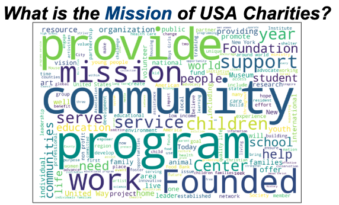
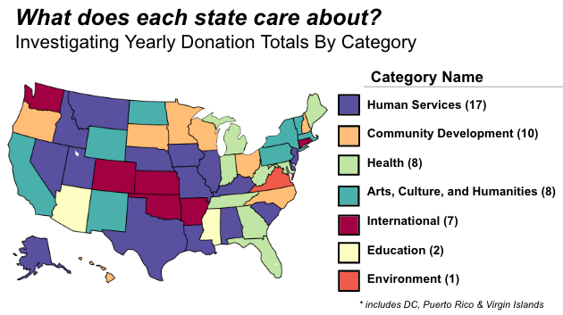

# USA Charity Exploratory Data Analysis
Exploratory Data Analysis project investigating USA charity data

## Project Focus
  * Gather Information about USA Charities
  * Perform Hypothesis Tests to gain insights

## Motivation
  * I'm interested in making a positive social impact
  * Charities have the opportunity to create lasting impact
  * For my next project, I plan to partner with a Charity Donating Organization

## Exploratory Insights - Wordmap and Top Categories by State

### Charities are about Providing Community Programs

### US States Donate to a Wide Variety of Categories

[A Slideshow Presentation of this Project is Available Here](https://docs.google.com/presentation/d/1fC8eIchbvQmftJSOCORGc7lxn1mhAFAN3U4ByL6KB78/edit#slide=id.g6006c310b7_0_140)
